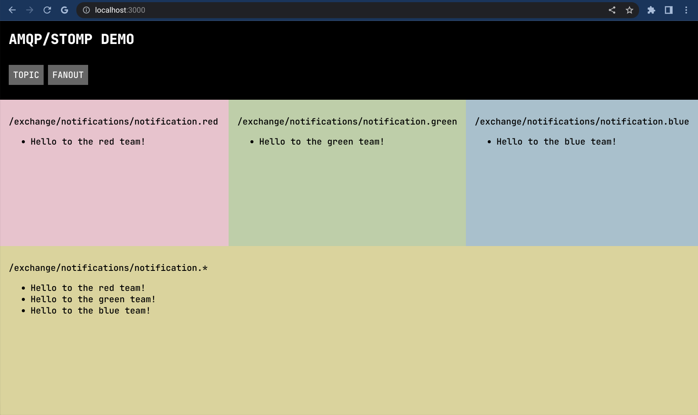
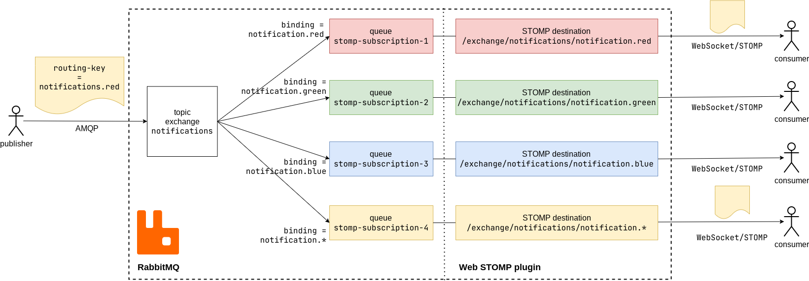
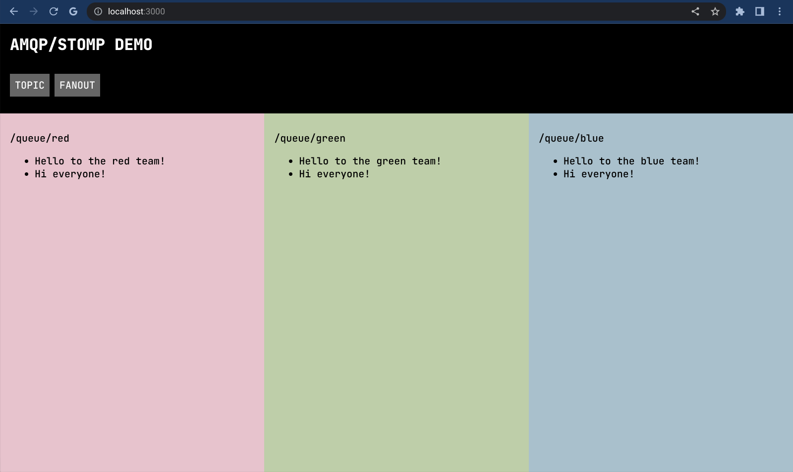

:source-highlighter: rouge
:highlightjs-theme: github
:highlightjs-languages: shell,dockerfile,js
:toc:

= Routing messages from RabbitMQ to the browser with Web STOMP plugin

*link:https://www.rabbitmq.com/[RabbitMQ]* is a message broker that uses
*link:https://www.rabbitmq.com/tutorials/amqp-concepts.html[AMQP]*
as its default/native protocol.

AMQP is not supported by web browsers. However, RabbitMQ comes with the
*link:https://www.rabbitmq.com/web-stomp.html[Web STOMP plugin]*
which maps AMQP to *link:https://stomp.github.io/[STOMP]*
(Simple Text Oriented Messaging Protocol) over WebSockets.

We are going to build a toy example with web clients consuming messages
from RabbitMQ via STOMP. I will also use this opportunity to explain AMQP
and how it relates to STOMP subsctiptions.

== STOMP protocol

The STOMP specification is simple and brief, you can read it here:
https://stomp.github.io/stomp-specification-1.2.html

Briefly, clients can both send messages to *destinations* and subscribe to
messages from *destinations*. Destination syntax and use is left to the server
implementation.

> A STOMP server is modelled as a set of destinations to which messages can be sent.
> The STOMP protocol treats destinations as opaque string and their syntax is
> server implementation specific. Additionally STOMP does not define what the
> delivery semantics of destinations should be. The delivery, or
> “message exchange”, semantics of destinations can vary from server to server
> and even from destination to destination. This allows servers to be creative
> with the semantics that they can support with STOMP.

We will be interested in subscribing to messages.

== AMQP: exchanges, queues, and bindings

The AMQP model is more sophisticated than STOMP.
A good overview is https://www.rabbitmq.com/tutorials/amqp-concepts.html
Here is my very brief summary.

- Messages normally come with *routing keys*. These act like tags that determine
where each message should be delivered.

- First, a message arrives to an *exchange*. It is a routing component that
decides where to pass the message.

- The exchange sends message to one or various *message queues*.
These are FIFO queues where the messages wait to be consumed.
(More generally, an exchange can also pass messages to another exchange.)

- Exchanges take routing decisions according to *bindings*.
A binding is a routing rule declared for an exchange.

AMQP allows us to declare exchanges, queues, and bindings on a running
server. STOMP has nothing like that.

== Exchange types

Different exchange types can route messages based on different conditions.
The above terminology should be more clear in particular cases.

=== Default exchange

The *default exchange* is assumed when we don't specify an exchange.

Then *routing keys* are treated as queue names. Sending a message with
routing key `foo.bar.baz` without a specific exchange will put the message
in the queue `foo.bar.baz`, assuming such a queue was declared.

When a queue is declared, it is automatically bound to the default exchange.
So *binding* in this case is implicit.

=== Fanout exchange

A *fanout exchange* allows us to broadcast messages to multiple consumers.

In this case *bindings* determine multiple queues where the messages should be
delivered. A copy of each message is sent to all bound destination.

*Routing keys* are ignored for fanouts.

=== Topic exchange

A *topic exchange* allows us to use bindings with wildcards.

*Routing keys* in this case are supposed to have dot separated hierarchical
format like `foo.bar.baz`.

*Bindings* are wildcard patterns:

- `*` matches all symbols up to dot `.`
- `#` matches all symbols, including dots `.`

E.g. `foo.bar.baz` matches `foo.\*.baz`, `foo.bar.*`, and `foo.#`

This is similar to subscribing to topics. A *message queue* should be created
by the subscriber, and then bound to the exchange with a pattern like above.

There is also a *header exchange* which routes messages according to their
headers rather than routing keys, but we won't go into the details.
Here we'll focus on topic and fanout exchanges.

== Message format

Message body is opaque to AMQP, but it is treated as a byte array.
This is different from STOMP, which is text-based. It is reasonable to encode
messages in JSON and send them with `content-type: application/json`.
Both AMQP and STOMP allow us to attach such headers.

In this demo, messages will be in plain text.

== How reliable is this?

We want to consume messages from a browser client. Above all, we should not
use STOMP over WebSocket for delivering important messages.
It is worth noting that both AMQP and STOMP implement two mechanisms:

- *Hearbeats* are special frames that are exchanged between client and server
in order to check if the TCP connection is alive. RabbitMQ STOMP plugin should
relate heartbeats in AMQP and STOMP; see https://www.rabbitmq.com/heartbeats.html

- *Acknowledgments* are special frames that notify that the message was consumed.

Heartbeats are important for consumers that may disconnect abruptly,
leaving a hanging connection.

== Setting up RabbitMQ

After reviewing the theory, let's setup RabbitMQ.

We need to enable `rabbitmq_web_stomp` plugin for our Docker image:

[source,dockerfile]
----
FROM rabbitmq:3.8-management
RUN rabbitmq-plugins enable --offline rabbitmq_management rabbitmq_web_stomp
----

Build and run a custom image:

[source,shell]
----
cd rabbitmq-stomp
sudo docker build -t rabbit-stomp .
sudo docker run -p 5672:5672 -p 15672:15672 -p 15674:15674 --name rabbit_demo rabbit-stomp
----

The ports are

- `5672`: default AMQP port,
- `15672`: RabbitMQ web management application / API (http://localhost:15672/),
- `15674`: default port for STOMP over WebSocket.

By default, RabbitMQ will have user `guest` with password `guest`,
and the Web STOMP plugin will use the same credentials.
In real life applications, both AMQP and STOMP can work over TLS.

== Declaring exchanges, queues and bindings

Now we want to add some exchanges, queues and bindings.

We can step into the running container and open the `bash` prompt:

[source,shell]
----
sudo docker exec -it rabbit_demo bash
----

We'll use `rabbitmqadmin` command.

There will be two exchanges:

- one topic exchange named `notifications`,
- another fanout exchange named `notify-all`.

[source,shell]
----
rabbitmqadmin declare exchange name=notifications type=topic durable=true
rabbitmqadmin declare exchange name=notify-all type=fanout durable=true
----

The fanout will have binding to three fixed queues:

- `red`,
- `green`,
- `blue`.

[source,shell]
----
for color in red green blue
do
    rabbitmqadmin declare queue name="$color" auto_delete=false durable=true
    rabbitmqadmin declare binding source=notify-all destination="$color"
done
----

After this, `rabbitmqadmin list queues` and `rabbitmqadmin list bindings`
should display

[source]
----
+-------+----------+
| name  | messages |
+-------+----------+
| blue  |          |
| green |          |
| red   |          |
+-------+----------+

+------------+-------------+-------------+
|   source   | destination | routing_key |
+------------+-------------+-------------+
|            | blue        | blue        |
|            | green       | green       |
|            | red         | red         |
| notify-all | blue        |             |
| notify-all | green       |             |
| notify-all | red         |             |
+------------+-------------+-------------+
----

The first bindings are to the default exchange, this is why the "source"
column is blank (blank exchange = default exchange).

Note that our topic exchange `notifications` has no bindings.
By default, if we send messages to `notifications`, they will go nowhere.
Here is an example:

[source]
----
# rabbitmqadmin publish routing_key='notification.red' payload='Can you hear me?' exchange='notifications'
Message published but NOT routed
----

When a consumer wants to subscribe to a specific topic, it is supposed to create
its own temporary queue and bind it to the topic exchange via some
binding key (possibly with wildcards). This means that the same topic may have
multiple consumers.

== How AMQP is mapped to STOMP

The complete documentation for STOMP implementation in the RabbitMQ plugin
can be found here: https://www.rabbitmq.com/stomp.html

In our situation, we are interested in two cases.

- Our three queues `red`, `green`, `blue` will be mapped to STOMP destinations
`/queue/red`, `/queue/green`, `/queue/blue`. Subscribing to these destinations
will consume messages from the message queues.

- For our topic exchange `notifications`, STOMP subscription to
`/exchange/notifications/<binding-key>` will create a new queue and bind it
to `notifications` with `<binding-key>`. E.g. we can subscribe to
`/exchange/notifications/notification.red`, or to all notifications at once
with `/exchange/notifications/notification.*`.

== Consuming messages with STOMP in JavaScript

For consuming messages, we will use
*link:https://github.com/stomp-js/stompjs[STOMP.js]* library.

This is link:https://www.npmjs.com/package/@stomp/stompjs[`@stomp/stompjs`]
on NPM. Don't confuse it with the old version
link:https://www.npmjs.com/package/stompjs[`stompjs`].

Here is a basic STOMP subscription.
This code works the same way in browser and Node.js:

[source,js]
----
const StompJs = require('@stomp/stompjs')

const topic = '/exchange/notifications/notification.*'

const connectionParams = {
  brokerURL: 'ws://localhost:15674/ws',
  connectHeaders: {
    login: 'guest',
    passcode: 'guest'
  },
  reconnectDelay: 5000,
  heartbeatIncoming: 4000,
  heartbeatOutgoing: 4000
}

const connectionCallBack = (stompMessage) => {
  console.log(`Got message from ${stompMessage.headers.destination}`)
  console.log(`> ${stompMessage.body}\n`)
}

const client = new StompJs.Client(connectionParams)

client.onConnect = (frame) => {
  console.debug('Connected to WebSocket')
  client.subscribe(topic, connectionCallBack)
}

client.activate()
----

Run `npm install` & `npm start` from link:vanilla-consumer/[`vanilla-consumer/`]

We should be able to see a new queue that was created by our consumer and
bound to the `notifications` exchange:

[source]
----
# rabbitmqadmin list queues
+------------------------+----------+
|          name          | messages |
+------------------------+----------+
| blue                   | 0        |
| green                  | 0        |
| red                    | 0        |
| stomp-subscription-... | 0        |
+------------------------+----------+

# rabbitmqadmin list bindings
+---------------+------------------------+------------------------+
|    source     |       destination      |       routing_key      |
+---------------+------------------------+------------------------+
|               | blue                   | blue                   |
|               | green                  | green                  |
|               | red                    | red                    |
|               | stomp-subscription-... | stomp-subscription-... |
| notifications | stomp-subscription-... | notification.*         |
| notify-all    | blue                   |                        |
| notify-all    | green                  |                        |
| notify-all    | red                    |                        |
+---------------+------------------------+------------------------+
----

Let's send some messages:

[source,shell]
----
for color in red green blue
do
    rabbitmqadmin publish routing_key="notification.$color" \
        payload="Hello to the $color team!" \
        exchange='notifications'
done
----

Our JavaScript application will receive

[source]
----
Got message from /exchange/notifications/notification.red
> Hello to the red team!

Got message from /exchange/notifications/notification.green
> Hello to the green team!

Got message from /exchange/notifications/notification.blue
> Hello to the blue team!
----

== React.js demo

Now we run `npm install` & `npm start` from link:web-consumer/[`web-consumer/`]
and go to http://localhost:3000/

=== Topic example

Our web application should subscribe to the following four STOMP destinations:

- `/exchange/notifications/notification.red`
- `/exchange/notifications/notification.green`
- `/exchange/notifications/notification.blue`
- `/exchange/notifications/notification.*`

Now `rabbitmqadmin list queues` should list four new queues
`stomp-subscription-...` bound to the `notifications` exchange.
Let's send some messages there:

[source,shell]
----
for color in red green blue
do
    rabbitmqadmin publish routing_key="notification.$color" \
        payload="Hello to the $color team!" \
        exchange='notifications'
done
----

We should see how our topic subscriptions receive their messages,
and subscription to `notification.*` gets all of them.

=== Fanout example

Now if we open the fanout demo and execute

[source,shell]
----
for color in red green blue
do
    rabbitmqadmin publish routing_key="$color" payload="Hello to the $color team!"
done

rabbitmqadmin publish routing_key='' payload='Hi everyone!' exchange='notify-all'
----

Then `"Hi everyone!"` will be received by the three subscriptions
`/queue/red`, `/queue/green`, `/queue/blue`, since the message was sent
to the fanout exchange `notify-all`.

== References

- link:https://www.rabbitmq.com/[RabbitMQ]
- link:https://www.rabbitmq.com/tutorials/amqp-concepts.html[AMQP 0-9-1 Model Explained]
- link:https://stomp.github.io/[STOMP]
- link:https://www.rabbitmq.com/stomp.html[STOMP] and
link:https://www.rabbitmq.com/web-stomp.html[Web STOMP] plugins
for RabbitMQ
- link:https://github.com/stomp-js/stompjs[STOMP.js] library for JavaScript
